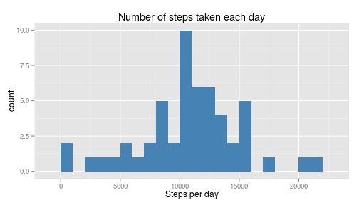
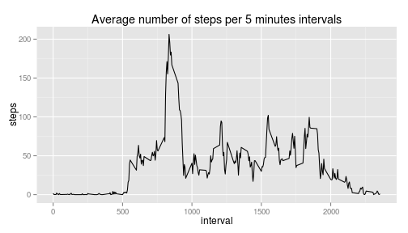
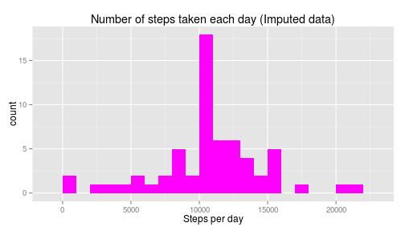
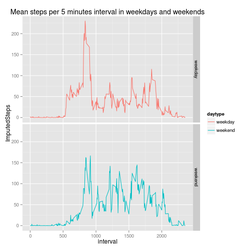

# Reproducible Research: Peer Assessment 1

Created February 2016

## Set options for the assignement

```r
options(scipen=999, digits = 3) # turn off scientific notation and display only few decimals
Sys.setlocale("LC_ALL", 'en_US.UTF-8') # Overrides Locale for the Weekdays part
```

```
## [1] "LC_CTYPE=en_US.UTF-8;LC_NUMERIC=C;LC_TIME=en_US.UTF-8;LC_COLLATE=en_US.UTF-8;LC_MONETARY=en_US.UTF-8;LC_MESSAGES=en_US.UTF-8;LC_PAPER=fr_FR.UTF-8;LC_NAME=C;LC_ADDRESS=C;LC_TELEPHONE=C;LC_MEASUREMENT=fr_FR.UTF-8;LC_IDENTIFICATION=C"
```


## Loading and preprocessing the data

**Note:** It is required that you download the [Activity monitoring data](https://d396qusza40orc.cloudfront.net/repdata%2Fdata%2Factivity.zip)


```r
## Unzip activity.zip if needed
if( !file.exists("activity.csv") ) {
  temp <- tempfile()
  file <- unzip("activity.zip")
  unlink(temp)
}

## Read data
activity <- read.csv("activity.csv")

## convert date variable to dates
activity$date <- as.Date(activity$date, format = "%Y-%m-%d")
```

## What is mean total number of steps taken per day?


```r
SumStepsPerDay<- with( activity, aggregate( steps ~ date, FUN = sum))
```

### Histogram of total number of steps per day

```r
## histogram of the total number of steps taken each day
library(ggplot2)
ggplot(data = SumStepsPerDay, aes(x = steps)) + geom_histogram(stat  ="bin", fill = "steelblue", binwidth = 1000) + ggtitle("Number of steps taken each day" ) + xlab("Steps per day")
```

 


```r
## Calculates Mean (rounded) and median of steps taken each day

MeanStepsPerDay <- mean(SumStepsPerDay$steps)
print(MeanStepsPerDay)
```

```
## [1] 10766
```

```r
MedianStepsPerDay <- median(SumStepsPerDay$steps)
print(MedianStepsPerDay)
```

```
## [1] 10765
```

The mean and median of steps taken per day are 10766.189 and 10765 respectively.

## What is the average daily activity pattern?

Time series plot of the 5-minute interval (x-axis) and the average number of steps taken, averaged across all days (y-axis)


```r
## Average number of steps per 5 minutes interval
MeanStepsPerInterval <- with( activity, aggregate( steps ~ interval, FUN = mean, na.rm = TRUE ))

qplot( x = interval, y = steps, data = MeanStepsPerInterval, geom = "line", main = "Average number of steps per 5 minutes intervals")
```

 

```r
MaxInterval <- MeanStepsPerInterval$interval[ which.max( MeanStepsPerInterval$steps  ) ] 
print(MaxInterval)
```

```
## [1] 835
```

```r
MaxSteps <- MeanStepsPerInterval$steps[ which.max( MeanStepsPerInterval$steps  ) ] 
print(MaxSteps)
```

```
## [1] 206
```
The time interval containing the maximum number of steps is 835 with an average of 206.17


## Imputing missing values

### Number of lines with NA values


```r
naNum <- nrow( activity[is.na(activity$steps), ] )
print(naNum)
```

```
## [1] 2304
```
There are 2304 rows with missing values in the activity dataset

### Imputing missing data


```r
MissingDays <- unique(activity$date[is.na(activity$steps)])
print(MissingDays)
```

```
## [1] "2012-10-01" "2012-10-08" "2012-11-01" "2012-11-04" "2012-11-09"
## [6] "2012-11-10" "2012-11-14" "2012-11-30"
```

```r
MissingDaysMean<- with( activity[ activity$date %in% MissingDays, ], tapply( steps, date, sum, na.rm = TRUE) )
print(MissingDaysMean)
```

```
## 2012-10-01 2012-10-08 2012-11-01 2012-11-04 2012-11-09 2012-11-10 
##          0          0          0          0          0          0 
## 2012-11-14 2012-11-30 
##          0          0
```
There are 8 days that contain no data at all, while the others appear to be complete.

For each of those, each time interval will be replaced by the mean number of steps for this particular time interval over the entire dataset

**Note:** This will add a new column (ImputedSteps) to the activity dataset rather than replacing the steps variable.


```r
## Create a vector with imputed step values if required
ImputedSteps <- NULL
ImputedValue <- NULL
for( i in 1:nrow(activity) ){
    if( is.na(activity$steps[i]) ) {
        MissingInterval <- activity$interval[i]
        ImputedValue <- MeanStepsPerInterval$steps[MeanStepsPerInterval$interval == MissingInterval]
    } else { ImputedValue <- activity$steps[i] }
    ImputedSteps <- c( ImputedSteps, ImputedValue )
}

## Add Imputed Steps values to the activity dataset
activity$ImputedSteps <- ImputedSteps
```

### The new histogram with imputed values


```r
## Calculate sum of steps per days
NewSumStepsPerDay<- with( activity, aggregate( ImputedSteps ~ date, FUN = sum ) )

## Creates histogram
ggplot(data = NewSumStepsPerDay, aes(x = ImputedSteps)) + geom_histogram(stat  ="bin", fill = "magenta", binwidth = 1000) + ggtitle("Number of steps taken each day (Imputed data)" ) + xlab("Steps per day")
```

 

### Comparing mean and median values


```r
NewMeanStepsPerDay <- mean(NewSumStepsPerDay$ImputedSteps)
print(NewMeanStepsPerDay)
```

```
## [1] 10766
```

```r
NewMedianStepsPerDay <- median(NewSumStepsPerDay$ImputedSteps)
print(NewMedianStepsPerDay)
```

```
## [1] 10766
```

The mean of steps taken per day is unchanged (10766.189 with NA and 10766.189 with imputed data). The median is changed from 10765 with NA to 10766.189.

## Are there differences in activity patterns between weekdays and weekends?

Create a daytype factor variable with two levels, "weekday" and "weekend"

```r
activity$weekday <- weekdays(as.Date(activity$date))
WeekendDays <- c("Saturday", "Sunday")
activity$daytype <- as.factor( ifelse(activity$weekday %in% WeekendDays, "weekend", "weekday") )
```

Panel Plot

```r
## Calculate mean steps per interval
MeanStepsPerIntervalWeek <- with( activity, aggregate( ImputedSteps ~ interval + daytype, FUN = mean, na.rm = TRUE ))

## Panel plot
ggplot(data = MeanStepsPerIntervalWeek , aes(x = interval, y = ImputedSteps, colour = daytype)) + geom_line(stat = "identity") + ggtitle("Mean steps per 5 minutes interval in weekdays and weekends" ) + facet_grid(daytype ~ .)
```

 

The mean number of steps at early time points is higher in weekdays than for weekends. The opposite trend can be observed for mean number of steps during the afternoon.
